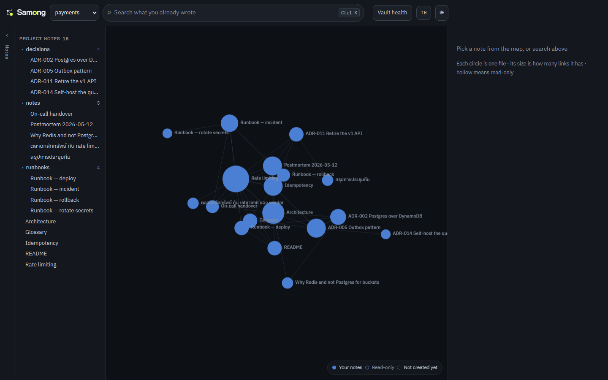
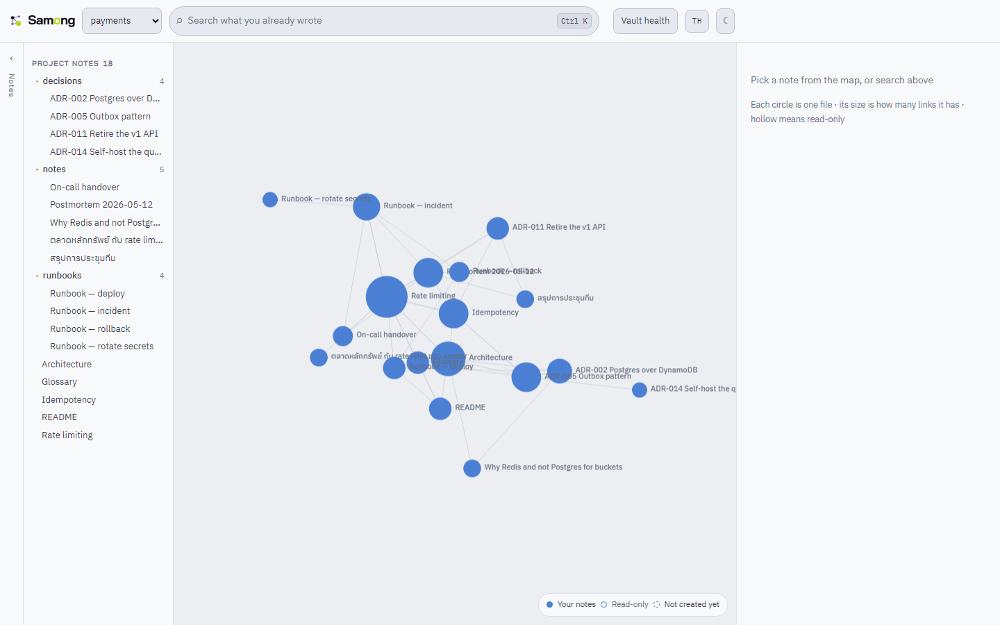

# Samong 🧠

[](https://github.com/waanvar/samong/actions/workflows/ci.yml)
[](LICENSE)

**A local-first second brain in Rust — with real Thai word-segmented full-text search**

Your notes are plain Markdown files, fully compatible with
[Obsidian](https://obsidian.md) (`[[wikilink]]` / `[[wikilink|alias]]`).
Samong adds a fast link graph, full-text search that **actually segments Thai**,
cross-vault links, a local API, and a web UI — while the `.md` files remain
the single source of truth.

*[เวอร์ชันภาษาไทย →](README.md)*



## Why Samong

- 🇹🇭 **Finds Thai words mid-sentence** — Thai has no spaces between words, so
  ordinary search engines see a whole sentence as one token. Samong segments
  Thai with the newmm dictionary
  ([nlpo3](https://github.com/PyThaiNLP/nlpo3)); searching
  "ตลาดหลักทรัพย์" matches "ตลาดหลักทรัพย์แห่งประเทศไทยเปิดทำการ" with
  highlighted snippets. Obsidian cannot do this.
- 📁 **Your files, your machine** — notes are plain Markdown with zero lock-in.
  Every index lives in `<vault>/.brain/` and can always be rebuilt with
  `samong reindex`.
- 🔗 **Multi-vault** — link across projects with `[[vault-name/note-title]]`;
  cross-vault backlinks are fully tracked.
- 🧭 **Ranked by relevance *and* connectedness** — when the words cannot tell two
  notes apart, the one the rest of your notes point at comes first. Capped at a
  25% boost, so a popular note never outranks one that plainly matches better.
- 🧠 **Semantic search, optional and local** — build with
  `--features semantic` and `samong embed` to also rank by meaning, using a
  multilingual model that reads Thai. Off by default on purpose: see below.
- ⚡ **Fast** — link graph in [redb](https://github.com/cberner/redb),
  search by [tantivy](https://github.com/quickwit-oss/tantivy), and
  incremental reindexing that only touches changed files.
- 🤖 **A brain for AI agents** — `samong-mcp` plugs into Claude Code /
  Claude Desktop over MCP so agents can search, read, and save knowledge
  themselves ([setup guide](docs/AI-AGENT.md)).

## Install

### Download a binary (recommended)

Grab one from [Releases](https://github.com/waanvar/samong/releases), extract,
run. **No Rust or Node needed** — the web UI is already inside the binary. Four
platforms: `x86_64-linux`, `x86_64-windows`, `aarch64-macos` (Apple Silicon),
`x86_64-macos` (Intel).

Verify what you downloaded against the `.sha256` published beside it:

```sh
sha256sum -c samong-v0.3.2-x86_64-linux.tar.gz.sha256
```

#### ⚠️ The binaries are not code-signed

Samong has no code-signing certificate yet, so the OS will get in the way:

**macOS** — Gatekeeper *refuses* to open it (not merely a warning). One command
after extracting clears it:

```sh
xattr -d com.apple.quarantine samong samong-server samong-mcp
```

**Windows** — SmartScreen warns; choose **More info → Run anyway**.

> Both happen to any open-source project without a paid certificate and are not a
> sign that something is wrong with the file — but do check the checksum above,
> and only download from the official Releases page.

### Or build from source

Needs [**Rust**](https://rustup.rs) (stable) and [**Node.js**](https://nodejs.org)
20+ (Node only if you want the web UI, which is embedded into the binary at build
time — without it you get the CLI + API).

```sh
git clone https://github.com/waanvar/samong.git
cd samong
cd web && npm install && npm run build   # build the web UI first (it gets embedded)
cd .. && cargo install --path .          # installs samong / samong-server / samong-mcp
```

> **Order matters**: build the web UI before `cargo build`/`cargo install` —
> `samong-server` **embeds the web UI into the binary**, so it ships as a single
> file with no UI folder alongside it. (To build without installing, use
> `cargo build --release`; binaries land in `target/release/`.)

Update to the latest version later with `samong update` (see *Updating* below).

## Quickstart

```sh
mkdir my-vault && cd my-vault
samong new "My First Note"         # create + index
samong vault add my-vault .        # register in ~/.config/samong
samong-server start               # opens http://127.0.0.1:3000 in your browser
```

`samong-server start` serves the embedded web UI and opens your browser — no UI
files needed alongside it. Change the port with `--port 8080`, skip the browser
with `--no-open` (the old `samong-server --port 8080` form still works).



## CLI commands

| Command | What it does |
|---|---|
| `samong new <title>` | Create a note + index it |
| `samong edit <title>` | Open in `$EDITOR`, reindex on close |
| `samong rename <old> <new>` | Rename + rewrite every `[[wikilink]]` pointing at it |
| `samong delete <title>` | Delete + warn about dangling backlinks |
| `samong links <title> [--all-vaults]` | Forward links + backlinks (incl. cross-vault) |
| `samong orphans` / `samong broken` | Unlinked notes / links to missing notes |
| `samong search <q> [--vault <name>\|--all-vaults] [--limit N]` | Full-text search (Thai/English) |
| `samong graph [--all-vaults]` | Link-graph edges |
| `samong list` | List every note |
| `samong reindex [--full]` | Sync the index (changed files only / everything) |
| `samong embed [--reference]` | Embed notes for semantic search (needs `--features semantic`) |
| `samong watch` | Watch the vault, keep the index fresh |
| `samong vault add/list/remove` | Manage the central registry |
| `samong doctor` | Report what counts as a note, what was skipped, and any ambiguous titles |
| `samong update [--check]` | Update to the latest GitHub release (--check only reports) |

### What counts as a note (vault scope)

One rule: **a note is a `.md` file you would commit.** Point `samong vault add`
straight at a project root — no configuration needed. Samong will:

- respect `.gitignore`, so `node_modules/`, `dist/` and `target/` never get indexed
- always skip dependency directories even when they are not gitignored
  (`node_modules`, `vendor`, `site-packages`, `__pycache__`, `Pods`, `bower_components`)
- skip every dot-directory (`.git`, `.obsidian`, `.brain`)

`samong doctor` shows what that adds up to:

```sh
samong doctor
# vault: /home/me/myproject
# gitignore: respected
# 4 note(s) in scope
# skipped 90 .md file(s) not tracked as notes (web 90)
```

To adjust it, add `samong.toml` at the vault root — **commit it**, so every
machine and any central server reads the same rules. Every field is optional:

```toml
[vault]
name = "myproject"        # the name used in [[myproject/note]] links

[scope]
notes_dir = "docs"        # only scan this subtree (default ".")
exclude = ["archive/**"]  # extra rules, gitignore syntax
include = []              # directories to index anyway (see below)
follow_gitignore = true   # turn off to index gitignored files too
max_depth = 0             # 0 = unlimited
```

If your repo gitignores its own notes, `.samongignore` brings them back. Same
syntax as gitignore, negation included:

```
!notes/
drafts/
```

### Learning from documentation you never commit (`scope.include`)

`.gitignore` answers **"what do I distribute?"**. A knowledge base has to answer
**"what do I learn from?"** — not the same question. The clearest case is
documentation shipped inside a dependency: Next.js puts 400-odd Markdown files
in `node_modules`.

```toml
[scope]
include = ["node_modules/next/dist/docs"]
```

Those become **reference notes** — same vault, same index, so `[[installation]]`
from your own note resolves. One project, one brain; no second vault.

> `.samongignore` with `!node_modules/...` cannot do this. Dependency
> directories are pruned before the walker looks inside them, so there is nothing
> for a negation to match, and gitignore itself cannot re-include a path whose
> parent is excluded. `scope.include` is the right lever.

**Two things to know:**

1. **Reference notes are machine-local.** `samong.toml` travels with git;
   `node_modules` does not. A machine that has not installed dependencies — or a
   server holding only git history — will not find them. That is *not* an error:
   Samong skips them and prints one warning line, and `samong doctor` reports
   which roots are present.
2. **Reference notes are read-only.** `save_note` / `PUT` / `delete` / `rename`
   refuse them: the file belongs to a dependency and any edit would be erased on
   the next install. This matters most for agents — `save_note("installation")`
   must not overwrite a framework's own docs page.

`exclude` applies to the main scan only. To leave part of an include root out,
point `include` at a narrower directory.

> Deliberately ignored: the global gitignore (`~/.config/git/ignore`),
> `.git/info/exclude`, and `.gitignore` files above the vault. Those are
> per-machine, and honoring them would make one repo index differently on two
> laptops.

### Updating

`samong update` downloads the latest GitHub release and replaces all three
binaries (samong / samong-server / samong-mcp) in place — including the embedded
web UI. `samong update --check` reports whether a newer version exists without
installing, and `samong-server start` prints a one-line notice when an update is
available (best-effort; never blocks, never fails offline).

> A published GitHub release is required first
> (`git tag v0.1.0 && git push origin v0.1.0` triggers the workflow that builds
> binaries for all three OSes) before `samong update` can find anything.

## Semantic search (optional)

Lexical search only finds notes that use the words you typed. When you cannot
remember the words you wrote, it finds nothing. Semantic search fixes that by
comparing meaning — and it is **off by default**, which is a decision, not an
oversight.

```bash
cargo install --path . --features semantic
samong embed              # your notes; run it again after you write a lot
samong embed --reference  # also the vendored docs from scope.include (slow)
samong search "how do we stop repeated requests"
```

**What it costs you.** The feature pulls in ONNX Runtime, and the first `embed`
downloads `intfloat/multilingual-e5-small` from Hugging Face into
`~/.config/samong/models` — **465 MB on disk**, measured, not estimated: a 470 MB
float32 ONNX graph plus a 17 MB tokenizer. Your notes and your queries still never
leave the machine, and nothing needs a network after that download. But "one
binary, nothing to fetch" stops being true, and that promise is why people choose
this over a cloud tool — so it is yours to opt into, not ours to impose.

Embedding is the slowest thing the program does. A real measurement: 430 notes,
most of them vendored Next.js documentation, took **11m 25s** on a laptop CPU.
That is also why reference notes are excluded unless you ask for them — they were
95% of that time.

**The model is multilingual on purpose.** Thai lexical search is the thing Samong
does that comparable projects do not, and the nearest one embeds with an
English-only model. Semantic search that could not read Thai would hand that
advantage away exactly where it matters most.

**How the two rankings combine.** Reciprocal Rank Fusion, not a weighted sum of
scores: BM25 is unbounded and cosine similarity is −1 to 1, so mixing the raw
numbers needs a calibration that drifts with every vault. Fusing *positions*
needs none. A note ranked well by both wins; a note ranked first by only one still
places.

Notes are chunked (~900 characters, split at paragraph breaks) so a long document
is matched by its relevant section rather than its first page, and each note
scores as its best chunk. Vectors live in `<vault>/.brain/vectors.redb`, stamped
with the same content hash the reindexer uses, so re-embedding skips unchanged
notes. Delete that file and the vault is exactly what it was.

`samong doctor` reports how many notes have vectors, so "semantic search did not
help" can be told apart from "nothing was embedded".

## Web UI

An original design, not an Obsidian clone. The whole UI is **embedded into the
`samong-server` binary** (rust-embed) — ships as one file, runs instantly, and
the fonts are bundled so it works offline.

- **The graph is the workspace**, painted to canvas (d3-force for layout) so it
  survives a vault of several hundred notes. Node size is its link count,
  colour is its vault.
- **Search is the way in**: `Ctrl+K` focuses the field in the frame — there is
  no palette to open. Typing dims every node that does not match, so a query
  becomes a place; `Esc` brings the whole map back.
- Selecting a node opens it beside the graph, with its links as chips that say
  whether they resolve. Reading full screen is a state on top of the map.
- Type `[[` for note autocomplete across vaults; click wikilinks to follow
  (missing notes are created on the spot)
- **English or Thai**, from `?lang=`, your saved choice, or the browser, and
  switchable in the header. English is the default.
- Dark/light themes, autosave, real-time over WebSocket — edit a file in
  Obsidian or any editor and the page updates itself
- **Vault health** reports what was indexed and what was skipped, so four notes
  where you expected ninety is a visible answer rather than a mystery

UI development: `cd web && npm run dev` (Vite proxies to samong-server on
port 3000).

## API (samong-server)

Binds to `127.0.0.1` only (local-first, no auth).

| Endpoint | Purpose |
|---|---|
| `GET /api/vaults` | Registered vaults |
| `POST /api/vaults` | Register a vault (`{name, path}`) — no terminal needed |
| `GET /api/vaults/{vault}/notes` | Notes in a vault: `{key, title, reference}` |
| `GET /api/vaults/{vault}/doctor` | The same scope report as `samong doctor` |
| `GET/PUT/DELETE /api/notes/{vault}/{path}` | Read / write / delete markdown, addressed by **path** |
| `GET /api/links/{vault}/{path}` | Forward + backlinks + cross-vault |
| `GET /api/search?q=&vault=&limit=` | Search (omit `vault` for all vaults) — results include the file `path` |
| `GET /api/graph?vault=` | Nodes + edges as JSON |
| `WS /ws` | Events when .md files change |

## AI agents (samong-mcp)

`samong-mcp` is an MCP server over stdio. Agents get these tools:
`search_notes` (Thai-segmented), `read_note`, `save_note`, `get_links`,
`list_notes`, `list_vaults` — deliberately no delete tool; erasing knowledge
stays a human action.

```json
// .mcp.json in your repo
{ "mcpServers": { "samong": { "command": "samong-mcp" } } }
```

Full setup and a `CLAUDE.md` recipe: [docs/AI-AGENT.md](docs/AI-AGENT.md)

## Architecture

```
<vault>/
  *.md            ← source of truth (Obsidian-compatible)
  .brain/
    graph.redb    ← forward/backlinks + mtimes + index version (redb)
    tantivy/      ← full-text index with the Thai newmm tokenizer (tantivy)
~/.config/samong/
  registry.redb   ← vault name -> path, for cross-vault links
```

Delete `.brain/` any time — `samong reindex` rebuilds everything from the
Markdown files. When the schema/tokenizer version changes, stale indexes are
rebuilt automatically.

## Development

```sh
cargo test                              # unit + integration tests
cargo clippy --all --all-targets -- -D warnings
cargo fmt --all -- --check
```

> Note: run `cd web && npm run build` before the first `cargo test` so the
> embedded-UI tests exercise a real build (they self-skip the UI part otherwise).

### Changing the web UI means reinstalling

The UI is **embedded into the binary at compile time** (rust-embed), so editing
anything under `web/` and then running an already-installed `samong-server` still
serves the old UI. Build, then install over it:

```sh
cd web && npm run build && cd ..
cargo install --path . --force
```

While working on the UI, use `cd web && npm run dev` (hot reload, proxied to the
API) or `cargo run --bin samong-server -- start`, which always picks up the
latest `web/dist` — much faster than reinstalling on every change.

## Roadmap

Done since the first public release: binaries for four platforms, an "add vault"
button in the web UI, connectedness-aware ranking, and optional local semantic
search.

- **A similarity floor for semantic search.** Rank fusion currently admits the
  top semantic hit unconditionally, so an unremarkable match can still reach
  position two. The threshold has to be measured against real vaults, not guessed.
- **A smaller embedding model.** 465 MB is a lot to ask; a quantised build of the
  same model would cut it substantially.
- User dictionary for Thai loanwords newmm does not know yet.
- Package as a desktop app via Tauri.
- **A central server that indexes git** — a team's vaults, searchable together,
  ingested from repositories rather than synced. Never a sync protocol of our own:
  git already solved conflicts, history, offline and auth.
- Cross-device sync and AI features (note summaries, ask-your-vault) — later, as
  an open-core layer.

## License

[Apache-2.0](LICENSE) — free to use, modify, and ship commercially, including
inside your own closed-source software. Keep the copyright notice and give
attribution.

All third-party components are credited in [THIRD-PARTY.md](THIRD-PARTY.md) —
the `words_th.txt` segmentation dictionary comes from
[PyThaiNLP](https://github.com/PyThaiNLP/pythainlp) (Apache-2.0).

### Name and logo

**"Samong" and the logo are not covered by Apache-2.0.** Fork the code, change
it, sell it — but please pick a different name for anything you ship separately,
so users are never confused about who maintains which version. Referring to this
project, comparing against it, or saying you are compatible with Samong needs no
permission.

The exclusion is written out in **[site/brand/LICENSE](site/brand/LICENSE)**,
beside the files it applies to, because the root LICENSE would otherwise read as
covering them: Apache-2.0 withholds trademark rights but grants broad rights over
artwork, and a clone of this repository has no way to guess that those six SVGs
are different. That file also lists what you may do without asking — which is
most things.
