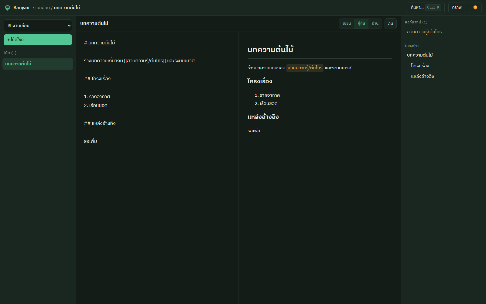

# Samong 🧠

[](https://github.com/waanvar/samong/actions/workflows/ci.yml)
[](LICENSE)

**มันสมองที่สองแบบ local-first เขียนด้วย Rust — ค้นหาภาษาไทยแบบตัดคำได้จริง**

โน้ตของคุณคือไฟล์ Markdown ธรรมดา เข้ากันได้กับ [Obsidian](https://obsidian.md)
(`[[wikilink]]` / `[[wikilink|alias]]`) — Samong เพิ่ม link graph ที่เร็ว,
full-text search ที่**ตัดคำไทยได้**, ลิงก์ข้าม vault, API และ Web UI
โดยไฟล์ `.md` เป็น source of truth เพียงแหล่งเดียวเสมอ

*[English version →](README.en.md)*



## ทำไมต้อง Samong

- 🇹🇭 **ค้นคำไทยกลางประโยคเจอ** — "ตลาดหลักทรัพย์แห่งประเทศไทยเปิดทำการ"
  ค้นด้วย "ตลาดหลักทรัพย์" หรือ "ประเทศไทย" เจอทันทีพร้อมไฮไลต์
  (ตัดคำด้วยพจนานุกรม newmm ผ่าน [nlpo3](https://github.com/PyThaiNLP/nlpo3) —
  สิ่งที่ Obsidian ทำไม่ได้)
- 📁 **ไฟล์ของคุณ เครื่องของคุณ** — โน้ต = Markdown ธรรมดา ไม่มี lock-in
  index ทั้งหมดอยู่ใน `<vault>/.brain/` และสร้างใหม่ได้เสมอด้วย `samong reindex`
- 🔗 **Multi-vault** — ลิงก์ข้ามโปรเจกต์ด้วย `[[ชื่อ-vault/ชื่อโน้ต]]`
  backlinks ข้าม vault แสดงครบ
- 🧭 **จัดอันดับด้วยความตรงคำ *และ* ความเชื่อมโยง** — เมื่อคำค้นแยกสองโน้ตไม่ออก
  โน้ตที่โน้ตอื่นชี้มามากจะขึ้นก่อน จำกัดที่ +25% เพื่อให้โน้ตที่คนลิงก์มาเยอะ
  ไม่มีทางชนะโน้ตที่ตรงคำกว่าชัดๆ
- 🧠 **ค้นด้วยความหมาย เป็นตัวเลือก และรันในเครื่อง** — build ด้วย
  `--features semantic` แล้วสั่ง `samong embed` จะได้อันดับที่คิดความหมายด้วย
  ใช้โมเดล multilingual ที่อ่านไทยได้ · ปิดไว้เป็นค่าเริ่มต้นโดยมีเหตุผล (ดูด้านล่าง)
- ⚡ **เร็ว** — link graph ใน [redb](https://github.com/cberner/redb),
  ค้นหาด้วย [tantivy](https://github.com/quickwit-oss/tantivy),
  incremental reindex แตะเฉพาะไฟล์ที่เปลี่ยน
- 🤖 **เป็นมันสมองของ AI agent ได้** — `samong-mcp` เสียบเข้า Claude Code /
  Claude Desktop ผ่าน MCP ให้ agent ค้น-อ่าน-บันทึกความรู้เองได้
  ([วิธีตั้งค่า](docs/AI-AGENT.md))

## ติดตั้ง

### ดาวน์โหลดไบนารี (แนะนำ)

โหลดจาก [หน้า Releases](https://github.com/waanvar/samong/releases) แตกไฟล์ แล้วรัน
**ไม่ต้องลง Rust หรือ Node** — หน้าเว็บฝังอยู่ในไบนารีแล้ว มีให้ 4 แพลตฟอร์ม:
`x86_64-linux`, `x86_64-windows`, `aarch64-macos` (Apple Silicon),
`x86_64-macos` (Intel)

ตรวจไฟล์ที่โหลดมาได้จาก `.sha256` ที่แนบมาคู่กัน:

```sh
sha256sum -c samong-v0.3.0-x86_64-linux.tar.gz.sha256
```

#### ⚠️ ไบนารียังไม่ได้เซ็นดิจิทัล

Samong ยังไม่มีใบรับรองสำหรับ code signing ฉะนั้นระบบปฏิบัติการจะขัดขวางไว้:

**macOS** — Gatekeeper จะ*ปฏิเสธ*ไม่ให้เปิด (ไม่ใช่แค่เตือน) ปลดด้วยคำสั่งเดียว
หลังแตกไฟล์:

```sh
xattr -d com.apple.quarantine samong samong-server samong-mcp
```

**Windows** — SmartScreen จะขึ้นเตือน กด **More info → Run anyway**

> ทั้งสองกรณีเกิดกับซอฟต์แวร์โอเพนซอร์สที่ไม่มีงบซื้อใบรับรอง ไม่ใช่สัญญาณว่าไฟล์
> ผิดปกติ — แต่คุณควรตรวจ checksum ข้างบนเสมอ และโหลดจากหน้า Releases ทางการเท่านั้น

### หรือ build จาก source

ต้องมี [**Rust**](https://rustup.rs) (stable) และ [**Node.js**](https://nodejs.org) 20+
(Node จำเป็นถ้าต้องการหน้าเว็บ เพราะ UI ถูกฝังลงในไบนารีตอน build — ไม่ลง Node
จะได้เฉพาะ CLI + API)

```sh
git clone https://github.com/waanvar/samong.git
cd samong
cd web && npm install && npm run build   # build Web UI ก่อน (จะถูกฝังในไบนารี)
cd .. && cargo install --path .          # ติดตั้ง samong / samong-server / samong-mcp ลงเครื่อง
```

> **ลำดับสำคัญ**: build Web UI ก่อน `cargo build`/`cargo install` เสมอ เพราะ
> `samong-server` จะ**ฝังหน้าเว็บไว้ในตัวไบนารี** ทำให้แจกไฟล์เดียวจบ
> ไม่ต้องมีโฟลเดอร์ UI ข้างๆ (ถ้าอยากลอง build เฉยๆ ไม่ติดตั้ง ใช้ `cargo build --release`
> ได้ไบนารีใน `target/release/`)

อัปเดตเป็นเวอร์ชันล่าสุดภายหลังด้วย `samong update` (ดูหัวข้อ *อัปเดตเวอร์ชัน* ด้านล่าง)

## เริ่มใช้งาน

```sh
mkdir my-vault && cd my-vault
samong new "โน้ตแรกของฉัน"        # สร้างโน้ต + index อัตโนมัติ
samong vault add my-vault .        # ลงทะเบียนเข้า registry (~/.config/samong)
samong-server start               # เปิดเบราว์เซอร์ที่ http://127.0.0.1:3000 ให้อัตโนมัติ
```

`samong-server start` เสิร์ฟหน้าเว็บที่ฝังในตัว แล้วเปิดเบราว์เซอร์ให้เอง —
ไม่ต้องมีไฟล์ UI ข้างๆ ปรับพอร์ตด้วย `--port 8080`, ไม่ให้เปิดเบราว์เซอร์ด้วย
`--no-open` (รูปแบบเดิม `samong-server --port 8080` ยังใช้ได้)


## คำสั่ง CLI

| คำสั่ง | หน้าที่ |
|---|---|
| `samong new <ชื่อ>` | สร้างโน้ตใหม่ + index |
| `samong edit <ชื่อ>` | เปิดใน `$EDITOR` แล้ว reindex เมื่อปิด |
| `samong rename <เก่า> <ใหม่>` | เปลี่ยนชื่อ + แก้ `[[wikilink]]` ทุกโน้ตที่ลิงก์มา |
| `samong delete <ชื่อ>` | ลบโน้ต + เตือน backlinks ที่จะค้าง |
| `samong links <ชื่อ> [--all-vaults]` | forward links + backlinks (รวมข้าม vault) |
| `samong orphans` / `samong broken` | โน้ตที่ไม่มีใครลิงก์ / ลิงก์ที่ชี้ไปโน้ตที่ไม่มี |
| `samong search <คำ> [--vault <ชื่อ>\|--all-vaults] [--limit N]` | ค้นหา full-text (ไทย/อังกฤษ) |
| `samong graph [--all-vaults]` | edges ของ link graph |
| `samong list` | รายชื่อโน้ตทั้งหมด |
| `samong reindex [--full]` | sync index (เฉพาะไฟล์ที่เปลี่ยน / ทั้งหมด) |
| `samong watch` | เฝ้า vault แล้วอัปเดต index อัตโนมัติ |
| `samong vault add/list/remove` | จัดการ registry กลาง |
| `samong doctor` | สรุปว่า vault นับไฟล์ไหนเป็นโน้ต ข้ามอะไรไป และ title ไหนกำกวม |
| `samong update [--check]` | อัปเดตเป็นเวอร์ชันล่าสุดจาก GitHub release (--check = เช็คเฉยๆ) |

### ไฟล์ไหนนับเป็นโน้ต (vault scope)

กฎเดียวที่ต้องจำ: **โน้ต = ไฟล์ `.md` ที่คุณจะ commit** ชี้ `samong vault add` ที่
root ของโปรเจกต์ได้เลย ไม่ต้องตั้งค่าอะไร — Samong จะ:

- เคารพ `.gitignore` (จึงไม่ดูด `node_modules/`, `dist/`, `target/` เข้ามา)
- ข้ามโฟลเดอร์ dependency ที่ไม่มีทางเป็นโน้ตเสมอ แม้ไม่ได้ gitignore
  (`node_modules`, `vendor`, `site-packages`, `__pycache__`, `Pods`, `bower_components`)
- ข้ามโฟลเดอร์ที่ขึ้นต้นด้วยจุดทั้งหมด (`.git`, `.obsidian`, `.brain`)

`samong doctor` บอกว่าตอนนี้นับได้กี่โน้ตและข้ามไปกี่ไฟล์:

```sh
samong doctor
# vault: /home/me/myproject
# gitignore: respected
# 4 note(s) in scope
# skipped 90 .md file(s) not tracked as notes (web 90)
```

อยากปรับ สร้าง `samong.toml` ที่ root ของ vault (**commit ไปกับ repo** เพื่อให้
ทุกเครื่องและ server เห็นกฎเดียวกัน — ทุกฟิลด์ optional):

```toml
[vault]
name = "myproject"        # ชื่อที่ใช้ใน [[myproject/โน้ต]] (ไม่ใส่ = ใช้จาก registry)

[scope]
notes_dir = "docs"        # จำกัดให้ scan แค่โฟลเดอร์นี้ (default = ".")
exclude = ["archive/**"]  # กฎเพิ่ม (gitignore syntax)
include = []              # โฟลเดอร์ที่ให้ index เพิ่ม แม้ gitignore กันไว้ (ดูหัวข้อถัดไป)
follow_gitignore = true   # ปิดได้ถ้าอยาก index ไฟล์ที่ gitignore ไว้
max_depth = 0             # 0 = ไม่จำกัดความลึก
```

ถ้า repo ของคุณ gitignore โน้ตของตัวเองไว้ (เช่นโน้ต local ใน `notes/`) ใช้
`.samongignore` ดึงกลับมาได้ — ไฟล์นี้ใช้ syntax เดียวกับ gitignore และ negate ได้:

```
!notes/
drafts/
```

### เรียนรู้จากเอกสารที่ไม่ได้ commit (`scope.include`)

`.gitignore` ตอบคำถามว่า **"จะแจกจ่ายอะไร"** แต่ฐานความรู้ต้องตอบว่า
**"จะเรียนรู้จากอะไร"** — สองอย่างนี้ไม่ใช่คำถามเดียวกัน ตัวอย่างชัดสุดคือเอกสารที่มา
พร้อม dependency เช่น Next.js ที่ ship ไฟล์ Markdown 400+ ไฟล์ไว้ใน `node_modules`

```toml
[scope]
include = ["node_modules/next/dist/docs"]
```

โน้ตที่ได้มาทางนี้เรียกว่า **reference notes** อยู่ใน vault เดียวกัน index เดียวกัน
ลิงก์ `[[installation]]` จากโน้ตของคุณถึงกันได้ — **หนึ่งโปรเจกต์ หนึ่งสมอง** ไม่ต้องแยก vault

> `.samongignore` กับ `!node_modules/...` **ใช้แทนกันไม่ได้** เพราะโฟลเดอร์ dependency
> ถูกตัดกิ่งทิ้งก่อน walker เดินเข้าไป จึงไม่มีรายการให้ negate และกฎ gitignore เองก็
> re-include ไฟล์ใต้ parent ที่ถูก exclude ไม่ได้ — `scope.include` คือคานงัดที่ถูก

**สองข้อที่ต้องรู้:**

1. **reference notes เป็นของเฉพาะเครื่อง** — `samong.toml` เดินทางไปกับ git แต่
   `node_modules` ไม่ ฉะนั้นเครื่องที่ยังไม่ `npm install` หรือ server ที่มีแต่ git
   history จะหาไม่เจอ ซึ่ง**ไม่ใช่ error** — Samong ข้ามแล้วเตือน 1 บรรทัด และ
   `samong doctor` บอกว่า root ไหนมี root ไหนไม่มี
2. **reference notes เป็น read-only** — `save_note` / `PUT` / `delete` / `rename` จะ
   ปฏิเสธ เพราะไฟล์เป็นของ dependency ถ้าเขียนลงไปจะหายตอน install ครั้งถัดไป
   (สำคัญกับ agent มาก: `save_note("installation")` ไม่ควรไปทับหน้าเอกสารของ framework)

`exclude` มีผลกับการ scan หลักเท่านั้น — ถ้าต้องการตัดบางส่วนของ include root
ให้ชี้ `include` ให้แคบลง

> ตั้งใจไม่อ่าน global gitignore (`~/.config/git/ignore`), `.git/info/exclude`
> และ `.gitignore` ของโฟลเดอร์เหนือ vault — ของพวกนี้เป็นของเฉพาะเครื่อง ถ้าเอามา
> ใช้ repo เดียวกันจะ index ไม่เหมือนกันบนสองเครื่อง

### อัปเดตเวอร์ชัน

`samong update` ดาวน์โหลด release ล่าสุดจาก GitHub แล้วแทนที่ไบนารีทั้งสาม
(samong / samong-server / samong-mcp) ให้อัตโนมัติ — รวมหน้าเว็บที่ฝังในตัวด้วย
`samong update --check` เช็คว่ามีเวอร์ชันใหม่ไหมโดยไม่ติดตั้ง และ `samong-server start`
จะแจ้งบรรทัดเดียวถ้ามีเวอร์ชันใหม่ (best-effort ไม่บล็อก ไม่ล้มถ้าออฟไลน์)

> วิธีออก release: `git tag v0.3.0 && git push origin v0.3.0` แล้ว
> [release.yml](.github/workflows/release.yml) จะ build ไบนารีทั้ง 4 แพลตฟอร์ม
> พร้อม checksum และแนบเข้า GitHub Release ให้เอง

## ค้นด้วยความหมาย (เป็นตัวเลือก)

การค้นด้วยคำหาเจอเฉพาะโน้ตที่ใช้คำเดียวกับที่คุณพิมพ์ ถ้าจำคำที่เคยเขียนไม่ได้
ก็หาไม่เจอเลย การค้นด้วยความหมายแก้ตรงนี้ — และมัน **ปิดไว้เป็นค่าเริ่มต้น**
ซึ่งเป็นการตัดสินใจ ไม่ใช่ความหลงลืม

```bash
cargo install --path . --features semantic
samong embed        # ครั้งเดียว และทำซ้ำเมื่อเขียนเพิ่มเยอะ
samong search "จะกันคนยิงซ้ำๆ ยังไง"
```

**สิ่งที่ต้องแลก**: ฟีเจอร์นี้ลาก ONNX Runtime เข้ามา และ `embed` ครั้งแรกจะ
ดาวน์โหลด `intfloat/multilingual-e5-small` (~120 MB) จาก Hugging Face ไปเก็บที่
`~/.config/samong/models` — **โน้ตกับคำค้นยังไม่ออกจากเครื่อง** และหลังโหลดเสร็จ
ไม่ต้องใช้เน็ตอีก แต่คำสัญญาว่า "ไฟล์เดียว ไม่ต้องโหลดอะไร" จะไม่จริงอีกต่อไป
และคำสัญญานั้นคือเหตุผลที่คนเลือกเราแทนของบนคลาวด์ จึงให้เป็นสิทธิ์ของคุณที่จะเปิด
ไม่ใช่สิ่งที่เรายัดเยียด

**โมเดลเป็น multilingual โดยเจตนา**: การค้นคำไทยคือสิ่งที่ Samong ทำได้แต่คนอื่นทำไม่ได้
และโปรเจกต์ที่ใกล้เราที่สุดใช้โมเดลอังกฤษล้วน — ถ้าการค้นด้วยความหมายอ่านไทยไม่ได้
ก็เท่ากับยกจุดแข็งให้เขาในจุดที่สำคัญที่สุด

**รวมสองอันดับด้วย Reciprocal Rank Fusion** ไม่ใช่ถ่วงน้ำหนักคะแนน เพราะ BM25
ไม่มีขอบเขตส่วน cosine อยู่ที่ −1 ถึง 1 การผสมเลขดิบต้อง calibrate และค่านั้น
เลื่อนไปตาม vault แต่การผสม*อันดับ*ไม่ต้อง — โน้ตที่ดีทั้งสองด้านชนะ
โน้ตที่ดีด้านเดียวก็ยังติด

โน้ตถูกซอยเป็นชิ้น ~900 ตัวอักษรโดยตัดที่ย่อหน้า เอกสารยาวจึงถูกจับด้วย*ส่วนที่ตรง*
ไม่ใช่แค่หน้าแรก และให้คะแนนตามชิ้นที่ดีที่สุด · vector อยู่ใน
`<vault>/.brain/vectors.redb` ตราด้วย content hash ตัวเดียวกับที่ reindexer ใช้
จึงไม่ embed ซ้ำโน้ตที่ไม่เปลี่ยน · ลบไฟล์นั้นแล้ว vault กลับเป็นเหมือนเดิมเป๊ะ

`samong doctor` บอกว่ามีโน้ตกี่ไฟล์ที่มี vector แล้ว เพื่อแยก "ค้นด้วยความหมาย
ไม่ช่วย" ออกจาก "ยังไม่ได้ embed อะไรเลย"

## Web UI

ดีไซน์ต้นฉบับ (ไม่ลอก Obsidian) — typography ไทยด้วย
IBM Plex Sans Thai ฝังในตัว ใช้ offline ได้ และหน้าเว็บทั้งชุดถูก**ฝังในไบนารี**
`samong-server` (rust-embed) แจกไฟล์เดียวเปิดใช้ได้ทันที

- **กราฟคือพื้นที่ทำงาน** วาดด้วย canvas (ใช้ d3-force คิด layout) จึงรอด vault
  ที่มีโน้ตหลายร้อยไฟล์ — ขนาด node คือจำนวนลิงก์ สีคือ vault
- **การค้นคือทางเข้า**: `Ctrl+K` โฟกัสช่องค้นที่อยู่บนกรอบอยู่แล้ว ไม่มี palette
  ให้เปิด พิมพ์แล้ว node ที่ไม่ตรงจะหมองลง คำค้นจึงกลายเป็นสถานที่ · `Esc`
  เรียกแผนที่ทั้งใบกลับมา
- เลือก node แล้วโน้ตเปิดข้างกราฟ ลิงก์แสดงเป็น chip ที่บอกว่าชี้ถึงจริงหรือไม่
  การอ่านเต็มจอเป็นสถานะที่ทับบนแผนที่ ไม่ใช่หน้าอื่น
- พิมพ์ `[[` แล้ว autocomplete ชื่อโน้ตรวมข้าม vault — คลิก wikilink เพื่อกระโดด
  ถ้าโน้ตยังไม่มีจะสร้างให้
- **เลือกภาษาอังกฤษหรือไทย** จาก `?lang=` ค่าที่เคยเลือก หรือภาษาของเบราว์เซอร์
  และสลับได้จากปุ่มบนหัว — **ค่าเริ่มต้นเป็นอังกฤษ**
- ธีมมืด/สว่าง, บันทึกอัตโนมัติ, real-time ผ่าน WebSocket —
  แก้ไฟล์จาก Obsidian หรือ editor อื่นแล้วหน้าจออัปเดตเอง
- **สภาพ vault** บอกว่าอะไรถูก index และอะไรถูกข้าม — เจอโน้ต 4 ไฟล์ทั้งที่คาดว่า
  มี 90 จะเป็นคำตอบที่มองเห็น ไม่ใช่ปริศนา

พัฒนา UI: `cd web && npm run dev` (Vite proxy ไป samong-server พอร์ต 3000)

## API (samong-server)

Bind เฉพาะ `127.0.0.1` เท่านั้น (local-first ไม่มี auth)

| Endpoint | หน้าที่ |
|---|---|
| `GET /api/vaults` | รายชื่อ vault ที่ลงทะเบียน |
| `POST /api/vaults` | ลงทะเบียน vault ใหม่ (`{name, path}`) — เพิ่มจากหน้าเว็บได้ |
| `GET /api/vaults/{vault}/notes` | โน้ตใน vault: `{key, title, reference}` |
| `GET /api/vaults/{vault}/doctor` | รายงาน scope แบบเดียวกับ `samong doctor` |
| `GET/PUT/DELETE /api/notes/{vault}/{path}` | อ่าน / เขียน / ลบ markdown (อ้างด้วย **path** ไม่ใช่ title) |
| `GET /api/links/{vault}/{path}` | forward + backlinks + cross-vault |
| `GET /api/search?q=&vault=&limit=` | ค้นหา (ละ `vault` = ทุก vault) — ผลลัพธ์มี `path` ของไฟล์ |
| `GET /api/graph?vault=` | nodes + edges เป็น JSON |
| `WS /ws` | event เมื่อไฟล์ .md เปลี่ยน |

## AI agent (samong-mcp)

`samong-mcp` เป็น MCP server บน stdio — agent ได้ tools: `search_notes`
(ค้นไทยตัดคำ), `read_note`, `save_note`, `get_links`, `list_notes`,
`list_vaults` (จงใจไม่มี delete — การลบเป็นเรื่องของมนุษย์)

```json
// .mcp.json ใน repo ของคุณ
{ "mcpServers": { "samong": { "command": "samong-mcp" } } }
```

ดูวิธีตั้งค่าเต็มและ recipe สำหรับ `CLAUDE.md` ที่ [docs/AI-AGENT.md](docs/AI-AGENT.md)

## สถาปัตยกรรม

```
<vault>/
  *.md            ← source of truth (Obsidian-compatible)
  .brain/
    graph.redb    ← forward/backlinks + mtimes + index version (redb)
    tantivy/      ← full-text index, tokenizer ไทย newmm (tantivy)
~/.config/samong/
  registry.redb   ← ชื่อ vault -> path สำหรับลิงก์ข้าม vault
```

ลบ `.brain/` ทิ้งเมื่อไหร่ก็ได้ — `samong reindex` สร้างใหม่จากไฟล์ .md ทั้งหมด
เมื่อ schema/tokenizer เปลี่ยนเวอร์ชัน index เก่าจะถูก rebuild อัตโนมัติ

## Development

```sh
cargo test                              # unit + integration tests
cargo clippy --all --all-targets -- -D warnings
cargo fmt --all -- --check
```

> หมายเหตุ: ต้อง `cd web && npm run build` ก่อน `cargo test` ครั้งแรก เพื่อให้
> เทสต์ที่เกี่ยวกับ UI ที่ฝังในไบนารีทำงานครบ (ถ้าไม่ build เทสต์จะข้ามส่วน UI ให้เอง)

### แก้ Web UI แล้วต้องติดตั้งใหม่

หน้าเว็บถูก**ฝังลงในไบนารีตอน compile** (rust-embed) ฉะนั้นแก้ไฟล์ใน `web/` แล้ว
รัน `samong-server` ตัวที่ติดตั้งไว้ จะยังเห็น UI เก่า — ต้อง build แล้วติดตั้งทับ:

```sh
cd web && npm run build && cd ..
cargo install --path . --force
```

ตอนพัฒนา UI ใช้ `cd web && npm run dev` (hot reload, proxy ไปที่ API) หรือรัน
`cargo run --bin samong-server -- start` ซึ่งใช้ `web/dist` ที่ build ล่าสุดเสมอ
จะเร็วกว่าการ `cargo install` ทุกครั้ง

## แผนต่อไป

- เปิด public + เผยแพร่ release binary (โหลดไปรันได้โดยไม่ต้องมี Rust/Node)
- พจนานุกรมคำศัพท์ผู้ใช้ (คำทับศัพท์ใหม่ๆ ที่ newmm ไม่รู้จัก)
- ปุ่มเพิ่ม vault ในหน้าเว็บ (ไม่ต้องใช้ terminal), แพ็กเป็น desktop app ด้วย Tauri
- Sync ข้ามเครื่อง / AI features (สรุปโน้ต, ถามตอบกับ vault) — เป็น open-core layer ภายหลัง

## License

[Apache-2.0](LICENSE) — ใช้ฟรี แก้ได้ นำไปใช้ในเชิงพาณิชย์ได้ รวมถึงฝังใน
ซอฟต์แวร์ปิดของคุณเอง ขอแค่คงประกาศลิขสิทธิ์และระบุที่มา

ที่มาของส่วนประกอบภายนอกทั้งหมดอยู่ใน [THIRD-PARTY.md](THIRD-PARTY.md) —
พจนานุกรมตัดคำ `words_th.txt` มาจาก
[PyThaiNLP](https://github.com/PyThaiNLP/pythainlp) (Apache-2.0)

### ชื่อและโลโก้

**"Samong" กับโลโก้ไม่ได้อยู่ใต้ Apache-2.0** — โค้ดเอาไป fork ดัดแปลง หรือขายได้
เต็มที่ แต่กรุณาใช้ชื่ออื่นกับผลงานที่แยกไปแล้ว เพื่อไม่ให้ผู้ใช้สับสนว่าใครดูแล
เวอร์ชันไหน (พูดถึงโปรเจกต์นี้ เปรียบเทียบ หรือบอกว่าเข้ากันได้กับ Samong —
ทำได้เสมอ ไม่ต้องขออนุญาต)
